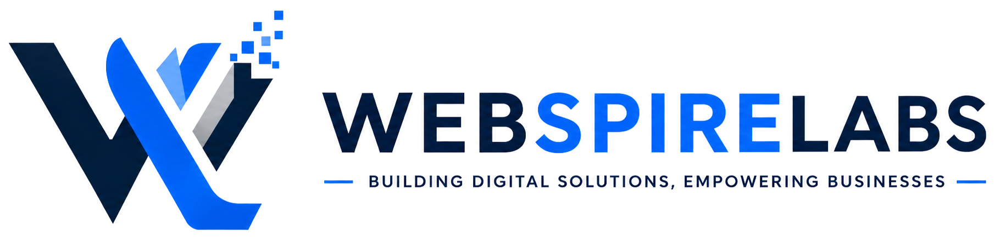

# WebSpire Labs — Enterprise IT Solutions & Web Engineering

<div align="center">



### *"Building Digital Solutions, Empowering Businesses."*

[](https://developer.mozilla.org/en-US/docs/Web/HTML)
[](https://developer.mozilla.org/en-US/docs/Web/CSS)
[](https://developer.mozilla.org/en-US/docs/Web/JavaScript)
[](https://getbootstrap.com/)
[](#responsive-design)
[](#seo--performance)

</div>

---

## 📖 Table of Contents

- [Executive Overview](#-executive-overview)
- [Website Pages & Architecture](#-website-pages--architecture)
- [Key Features & User Experience](#-key-features--user-experience)
- [Technology Stack](#-technology-stack)
- [Design System & Color Tokens](#-design-system--color-tokens)
- [Directory & File Structure](#-directory--file-structure)
- [Getting Started & Local Development](#-getting-started--local-development)
- [SEO, Accessibility & Performance](#-seo-accessibility--performance)
- [Browser Compatibility](#-browser-compatibility)
- [Contributing & Maintenance](#-contributing--maintenance)
- [License & Copyright](#-license--copyright)

---

## 🏢 Executive Overview

**WebSpire Labs** is a premier digital engineering and enterprise IT consulting agency. This repository contains the production source code for the WebSpire Labs official corporate website. 

Engineered with a high-performance **Multi-Page Application (MPA)** architecture, the site pairs the solid grid scaffolding of **Bootstrap 5.3.3** with a proprietary custom vanilla CSS design system and lightweight client-side JavaScript micro-interactions. It delivers seamless navigation, high accessibility, rich micro-animations, and fast page loads.

---

## 🌐 Website Pages & Architecture

The website features fully realized, standalone HTML pages tailored for conversion, client education, and brand storytelling:

| Page | File | Description |
| :--- | :--- | :--- |
| **Home** | [`index.html`](index.html) | Brand introduction, hero carousel, core capabilities, interactive tech tabs, featured case studies, testimonial sliders, and dynamic FAQ. |
| **About Us** | [`about.html`](about.html) | Company heritage, mission & vision, core leadership values, animated stats counters, team showcase, and dynamic constellation canvas effect. |
| **Services Overview** | [`services.html`](services.html) | Comprehensive catalog of services: Web Development, Cloud Infrastructure, Mobile Applications, Cybersecurity, AI & Data Engineering, and UI/UX Design. |
| **Web Development** | [`web-development.html`](web-development.html) | Dedicated service deep-dive featuring core web capabilities, modern tech stack matrix, 5-stage engineering lifecycle, and rich SEO FAQ schema. |
| **Blog Listing** | [`blog.html`](blog.html) | Engineering insights, industry trends, category filtering, search input, and paginated article cards. |
| **Blog Detail** | [`blog-detail.html`](blog-detail.html) | Rich article template with reading-time indicator, author bio, social sharing triggers, syntax-highlighted code snippets, and related reads. |
| **Contact Us** | [`contact.html`](contact.html) | Interactive contact inquiry form, direct communication channels, office location coordinates, and embedded map integration. |

---

## ⚡ Key Features & User Experience

- **Unified Navigation & Header:** Standardized sticky navbar across all pages with active page indicators, smooth dropdown transitions, and quick CTA buttons.
- **Synchronized Global Footer:** Enterprise 4-column footer featuring company bio, quick links, service anchors, contact metadata, and copyright compliance.
- **Hero & Carousel Modules:** Interactive, touch-enabled hero banners with subtle gradient accents, responsive typography, and animated entrance cues.
- **Interactive Tech Stack Tabs:** Dynamic tab switching showcasing technologies across Web Development, Frontend, Backend, Databases, and Cloud.
- **Particle Constellation Canvas:** High-tech dynamic particle mesh (`constellation-bg.js`) adding subtle visual depth to hero and background sections.
- **Accessible Accordion FAQ:** SEO-ready, ARIA-compliant expandable accordions with smooth max-height transitions and zero page shift.
- **Client-Side Form Validation:** Clean, accessible validation feedback for customer touchpoints on the Contact Us page.
- **Zero Heavy Framework Lock-In:** Built cleanly without runtime overhead (no React/Vue hydration cost), yielding near-instant First Contentful Paint (FCP).

---

## 🛠️ Technology Stack

| Layer | Technology | Purpose |
| :--- | :--- | :--- |
| **Markup** | **HTML5** | Semantic, standards-compliant structure (`<main>`, `<header>`, `<section>`, `<footer>`, `<article>`). |
| **Grid & Scaffold** | **Bootstrap 5.3.3** | 12-column responsive grid, container sizing, modal/dropdown fundamentals. |
| **Styling** | **Vanilla CSS3** | Custom design tokens, glassmorphism, flexbox/grid layouts, micro-animations, and media queries. |
| **Interactive Logic** | **Vanilla JavaScript (ES6+)** | Navigation triggers, particle canvas, testimonial slider, FAQ accordions, and DOM observers. |
| **Typography** | **Google Fonts** | Modern sans-serif pairings: *Inter*, *Outfit*, and *Plus Jakarta Sans*. |
| **Iconography** | **FontAwesome 6 / SVG** | High-DPI, vector icons for tech logos, feature badges, and social media links. |
| **SEO & Discoverability**| **Schema.org / OpenGraph** | Structured metadata, XML sitemap (`sitemap.xml`), and crawler directives (`robots.txt`). |

---

## 🎨 Design System & Color Tokens

The visual identity relies on a curated corporate palette defined using CSS custom properties:

```css
:root {
  /* Brand Primary & Accents */
  --primary: #0062FE;           /* IBM Blue / Signature Primary */
  --primary-hover: #0050d4;     /* Deepened Interactive Hover */
  --accent-cyan: #00D2D3;       /* Cyan Accent Gradient Stop */
  --accent-teal: #00A3C4;       /* Teal Accent Gradient Stop */

  /* Neutrals & Dark Tones */
  --dark-indigo: #0F172A;       /* Slate 900 / Heading Text & Dark Shells */
  --body-color: #475569;        /* Slate 600 / Crisp Body Typography */
  --border-color: #E2E8F0;      /* Slate 200 / Subtle Card & Section Dividers */

  /* Surface Backgrounds */
  --bg-page: #FFFFFF;           /* Crisp Content White */
  --bg-surface: #F4F5F7;        /* Cool Grey Hero & Breadcrumb Background */
  --bg-card: #FFFFFF;           /* Card & Panel Surface */
  --bg-subtle: #F8FAFC;         /* Soft Background Fill */

  /* Shadows & Elevations */
  --shadow-sm: 0 2px 8px rgba(15, 23, 42, 0.05);
  --shadow-md: 0 8px 24px rgba(15, 23, 42, 0.08);
  --shadow-lg: 0 16px 40px rgba(15, 23, 42, 0.12);
}
```

---

## 📁 Directory & File Structure

```text
Web_spire/
│
├── index.html                     # Main Homepage
├── about.html                     # Company About Us Page
├── services.html                  # Services Directory Page
├── web-development.html           # Dedicated Web Development Service Page
├── blog.html                      # Tech Blog & Article Index
├── blog-detail.html               # Individual Blog Post Template
├── contact.html                   # Contact Us & Consultation Page
│
├── robots.txt                     # Search Engine Crawler Directives
├── sitemap.xml                    # SEO XML Sitemap
│
├── css/                           # Modular CSS Architecture
│   ├── style.css                  # Global Shared Master Stylesheet & Design Tokens
│   ├── home.css                   # Homepage-Specific Styles
│   ├── about.css                  # About Us Page Styles
│   ├── services.css               # Services Directory Styles
│   ├── web-development.css        # Specialized Web Development Service Styles
│   ├── blog.css                   # Blog & Article Detail Styles
│   ├── contact.css                # Contact Us Form & Layout Styles
│   └── constellation.css          # Canvas Particle Overlay Styles
│
├── js/                            # Vanilla JavaScript Modules
│   ├── main.js                    # Global Main Script (Sticky Navbar, FAQ, Counter)
│   ├── blog.js                    # Blog Search & Category Filter Logic
│   ├── constellation-bg.js        # Canvas Particle Constellation Visualizer
│   ├── hero-carousel.js           # Lightweight Hero Slider Controller
│   ├── testimonials-slider.js     # Responsive Testimonial Carousel Script
│   ├── why-choose-accordion.js    # Interactive Feature Accordion Controller
│   └── header.js                  # Header & Mobile Nav Utilities
│
├── asstes/                        # Brand Assets & Media (Images, SVGs, Logos)
│   ├── logo_1.png                 # Primary Color Horizontal Wordmark
│   ├── logo-footer.png            # Inverted White Logo for Dark Footers
│   ├── favicon.png                # Monogram Browser Favicon (512x512)
│   ├── tech-logos/                # Technology & Framework Vector Icons (SVG)
│   ├── team/                      # Leadership & Team Portraits
│   └── projects/                  # Case Study & Project Preview Photography
│
├── videos/                        # Video Background Media
│
└── document/                      # Architectural Blueprints & Design Specifications
    ├── DESIGN_SYSTEM_SPECIFICATION.md  # Comprehensive Architectural & BS5 Spec Guide
    ├── HEADER_IMAGE_SPECIFICATIONS.md  # Full-Screen Header Image Dimensions & Implementation Guide
    ├── HOME_PAGE_SPECIFICATION.md      # Detailed Homepage Blueprint & Wireframes
    └── REMOVED_HOVER_EFFECTS.md        # UI/UX Transition Audit Logs
```

---

## 🚀 Getting Started & Local Development

Because the site is built on standard web technologies, no build steps or heavy compilation pipelines are required.

### 1. Clone the Repository
```bash
git clone https://github.com/santhosh202004/Web_Spire.git
cd Web_Spire
```

### 2. Run Locally

Choose any of the following convenient options:

#### Option A: VS Code Live Server (Recommended)
1. Open the project folder in **Visual Studio Code**.
2. Install the **Live Server** extension (by Ritwick Dey).
3. Right-click [`index.html`](index.html) and select **"Open with Live Server"**.

#### Option B: Node.js `serve` / `http-server`
```bash
npx serve .
# or
npx http-server -p 3000
```
Open your browser at `http://localhost:3000`.

#### Option C: Python Simple Server
```bash
# Python 3.x
python -m http.server 8000
```
Open your browser at `http://localhost:8000`.

#### Option D: Direct Browser Access
Double-click any HTML file (e.g., `index.html`, `about.html`, `web-development.html`) to launch it directly in your browser.

---

## 🔍 SEO, Accessibility & Performance

- **Semantic HTML5:** Built using standard landmark regions (`header`, `nav`, `main`, `section`, `article`, `footer`) to provide optimal hierarchy for screen readers and search crawlers.
- **Search Engine Optimization (SEO):**
  - Descriptive, unique `<title>` and `<meta name="description">` tags on every page.
  - Complete OpenGraph (`og:*`) and Twitter Card metadata for rich social previews.
  - Canonical link tags preventing duplicate content indexing.
  - Valid `robots.txt` and `sitemap.xml` configured for search indexing.
- **Accessibility (WCAG 2.1 AA Compliant):**
  - High-contrast text ratios adhering to accessibility standards.
  - Interactive accordions and dropdowns feature explicit `aria-expanded`, `aria-controls`, and `role` attributes.
  - Descriptive `alt` attributes for all meaningful imagery and icons.
- **High Performance:**
  - Modern image compression and dimension constraints.
  - Asynchronous / deferred script loading preventing DOM render-blocking.
  - Hardware-accelerated CSS transforms (`translate3d`, `transform`, `opacity`) for smooth 60 FPS transitions.

---

## 💻 Browser Compatibility

The website is actively verified across modern desktop and mobile browsers:

| Browser | Supported Versions |
| :--- | :--- |
| **Google Chrome** | Latest 3 versions (Windows, macOS, Android) |
| **Mozilla Firefox** | Latest 3 versions (Windows, macOS, Linux) |
| **Apple Safari** | Latest 2 versions (macOS, iOS, iPadOS) |
| **Microsoft Edge** | Latest 3 versions (Windows, macOS) |

---

## 🛠️ Contributing & Maintenance

When adding new service pages or updating existing components:
1. **Maintain Consistent Layouts:** Inherit navbar and footer structures directly from [`about.html`](about.html) to ensure site-wide cohesion.
2. **Respect Design Tokens:** Use defined CSS variables in `css/style.css` rather than hardcoding arbitrary HEX values.
3. **Keep Code Clean:** Maintain clean indentation, write descriptive class names, and avoid inline styling.
4. **Test Responsiveness:** Validate layouts across Mobile (`<576px`), Tablet (`768px-991px`), and Desktop (`≥992px`) viewports.

---

## 📄 License & Copyright

Copyright © 2026 **WebSpire Labs**. All rights reserved.  
All brand assets, project photography, and trademarks are proprietary to WebSpire Labs.

---

<div align="center">
  <sub>Engineered with precision by the <strong>WebSpire Labs</strong> Digital Engineering Team.</sub>
</div>
