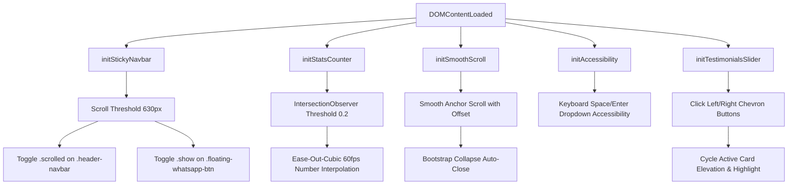

# WebSpire Labs — Master Website Architecture & Design System Specification Guide

---

## 1. Executive Overview & Codebase Architecture

**WebSpire Labs** is an enterprise-grade, high-performance IT solutions and software engineering company website. The codebase is engineered using modern HTML5 semantic architecture, CSS3 custom property design tokens, client-side vanilla JavaScript micro-interactions, and **Bootstrap 5.3.3** for foundational grid scaffolding and responsive navigation behavior.

* **Brand Name:** WebSpire Labs
* **Core Tagline:** *"Building Digital Solutions, Empowering Businesses."*
* **Architecture Model:** Static Multi-Page Application (MPA) with Modular Hybrid Styling (Bootstrap 5 Grid + Custom Vanilla CSS Design System).

```
d:\St_website\Web_spire\
├── index.html                           # Homepage (9 Major Sections, 1,061 lines)
├── about.html                           # About Us Page (10 Major Sections, 1,083 lines)
├── contact.html                         # Contact Us Page (4 Major Sections + Form, 855 lines)
├── robots.txt                           # Search Engine Crawler Directives
├── sitemap.xml                          # Search Engine XML Sitemap
│
├── css/
│   └── style.css                        # Master Design System & Component Stylesheet (3,923 lines, ~80KB)
│
├── js/
│   └── main.js                          # Core Interactive Logic (Sticky Nav, Observers, Counter, Testimonials Slider, A11y)
│
├── asstes/                              # Production Brand Media & Imagery
│   ├── logo_1.png                       # Official WebSpire Labs Horizontal Logo (Transparent Alpha, 1820x440)
│   ├── logo-footer.png                  # White-Wordmark Variant for Dark Footers
│   ├── favicon.png                      # Isolated Monogram Icon (512x512)
│   ├── hero-placeholder.svg             # Scalable Vector Graphics Placeholder
│   └── contact-hero.jpg                 # Contact Page Showcase Image
│
└── document/                            # Design Blueprints & Documentation
    ├── DESIGN_SYSTEM_SPECIFICATION.md   # Master Architectural & Technical Documentation (This Document)
    ├── HEADER_IMAGE_SPECIFICATIONS.md   # Full-Screen Header Image Dimensions & Implementation Guide
    ├── REMOVED_HOVER_EFFECTS.md         # Audit of Refined/Removed Hover Interactions
    ├── trash_hover_effects.css          # Isolated CSS Archive of Legacy Hover Effects
    ├── optimized.md                     # Checklist for SEO, Performance & Business Best Practices
    ├── About_US_Page_images/            # High-Resolution Design Mockups (About Page)
    ├── Home_page_images/                # UI Design Assets (Home Page)
    └── contact_us/                      # UI Design Mockups (Contact Us Page)
```

---

## 2. Technology Stack & Framework Analysis: Bootstrap Usage (`{BS}`)

### 🔍 Did You Use Bootstrap?
**YES, Bootstrap 5.3.3 is actively integrated and utilized across the entire project.**

### A. Bootstrap Integration Points

1. **CDN Style Sheets (Loaded in `<head>` of all pages):**
   ```html
   <!-- Bootstrap 5 CSS CDN -->
   <link href="https://cdn.jsdelivr.net/npm/bootstrap@5.3.3/dist/css/bootstrap.min.css" rel="stylesheet" integrity="sha384-QWTKZyjpPEjISv5WaRU9OFeRpok6YctnYmDr5pNlyT2bRjXh0JMhjY6hW+ALEwIH" crossorigin="anonymous">
   ```
   * Present in: [`index.html:L40`](file:///d:/St_website/Web_spire/index.html#L40), [`about.html:L41`](file:///d:/St_website/Web_spire/about.html#L41), [`contact.html:L36`](file:///d:/St_website/Web_spire/contact.html#L36).

2. **CDN JavaScript Bundles (Loaded before `</body>` on all pages):**
   ```html
   <!-- Bootstrap 5 Bundle JS CDN -->
   <script src="https://cdn.jsdelivr.net/npm/bootstrap@5.3.3/dist/js/bootstrap.bundle.min.js" integrity="sha384-YvpcrYf0tY3lHB60NNkmXc5s9fDVZLESaAA55NDzOxhy9GkcIdslK1eN7N6jIeHz" crossorigin="anonymous"></script>
   ```
   * Present in: [`index.html:L1057`](file:///d:/St_website/Web_spire/index.html#L1057), [`about.html:L1078`](file:///d:/St_website/Web_spire/about.html#L1078), [`contact.html:L849`](file:///d:/St_website/Web_spire/contact.html#L849).

3. **Bootstrap Core Components & Utilities in HTML:**
   * **Responsive Navigation:** `.navbar`, `.navbar-expand-lg`, `.navbar-brand`, `.navbar-toggler`, `.navbar-toggler-icon`, `.navbar-collapse`, `.navbar-nav`, `.nav-item`, `.nav-link`, `data-bs-toggle="collapse"`, `data-bs-target="#navbarMainContent"`.
   * **Grid & Scaffolding System:** `.container`, `.row`, `.col-lg-6`, `.col-lg-7`, `.col-lg-5`, `.col-lg-3`, `.col-lg-2`, `.col-lg-4`, `.col-md-6`, `.col-6`, `.gy-4`, `.gy-5`, `.g-3`, `.g-4`.
   * **Display & Alignment Utilities:** `.d-none`, `.d-lg-none`, `.d-lg-flex`, `.align-items-center`, `.align-items-stretch`, `.justify-content-center`, `.position-relative`, `.position-absolute`, `.mx-auto`, `.text-center`.
   * **Form Elements (`contact.html`):** `.form-control`, `.form-label`, `.form-select`.

4. **Bootstrap JavaScript API Consumption in [`js/main.js`](file:///d:/St_website/Web_spire/js/main.js):**
   * Programmatic Mobile Navbar Collapse Closure on anchor link navigation:
     ```javascript
     const bsCollapse = bootstrap.Collapse.getInstance(navbarCollapse);
     if (bsCollapse) bsCollapse.hide();
     ```
   * Accessible Dropdown Keyboard Triggering:
     ```javascript
     const dropdown = bootstrap.Dropdown.getOrCreateInstance(toggle);
     dropdown.toggle();
     ```

### B. Architectural Relationship (Bootstrap vs Custom CSS)
The project utilizes a **Bespoke Hybrid Pattern**:
* **Bootstrap 5** handles base fluid grid scaffolding (`.container`, `.row`, `.col-*`) and offcanvas/collapse event toggles.
* **Custom CSS ([`css/style.css`](file:///d:/St_website/Web_spire/css/style.css))** handles all visual styling, brand color tokens, custom CSS Grid cards (`.services-grid`, `.why-pillars-grid`, `.values-grid`, `.work-cards-grid`, `.help-grid-*`), SVG geometric rotations (diamond polygon backdrops), floating badges, and animations. Custom CSS takes full precedence over standard Bootstrap components.

---

## 3. Brand Identity & Logo Specification

### A. Logo Anatomy & Visual Elements
1. **Geometric Monogram (Icon):**
   - Interlocking, 3D-angled geometric letterforms representing **"W"**, **"S"**, and **"L"**.
   - **Left Wing:** Deep midnight navy chevron (`#071C35`).
   - **Central Dynamic Swoosh:** Bright royal electric blue (`#0062FE`) that curves forward.
   - **Right Layer & Shadow:** Dual-tone sky blue (`#5396F8`) and subtle gray-blue shading creating optical depth.
   - **Dispersing Pixels / Digital Voxels:** Ascending square digital particles (`#0062FE`) erupting from the top-right stroke, symbolizing cloud acceleration, data transmission, and digital transformation.

2. **Wordmark & Typography:**
   - **"WEB"**: Deep Midnight Navy (`#0B1B32`), bold geometric sans-serif.
   - **"S"**: Electric Cobalt Blue (`#0062FE`), highlighting the "Spire" brand accent.
   - **"PIRE"**: Deep Midnight Navy (`#0B1B32`).
   - **"LABS"**: Electric Cobalt Blue (`#0062FE`), maintaining brand synergy.
   - **Tagline Banner:** *"BUILDING DIGITAL SOLUTIONS, EMPOWERING BUSINESSES"* set between horizontal anchor rules in uppercase with generous tracking (`letter-spacing: 0.18em`).

### B. Logo Usage Guidelines
* **Primary (Light Backgrounds):** Full color transparent horizontal lockup (`asstes/logo_1.png`).
* **Dark Backgrounds / Footer:** High-contrast white-wordmark variant (`asstes/logo-footer.png`).
* **Header Navigation Size:** Height: `42px` desktop / `32px` mobile (proportional width).
* **Clear Space Rule:** Maintain a minimum clear zone equal to the height of the letter "W" around the entire logo mark.
* **Favicon / App Icon:** Use isolated "W" monogram centered on a transparent canvas (`asstes/favicon.png`).

---

## 4. Color Palette & Token Architecture

The color system uses a high-contrast triad of **Electric Cobalt Blue** (action & energy), **Deep Midnight Navy** (stability & enterprise trust), and **Pristine White / Slate Neutrals** (clarity & legibility), augmented with subtle Amber and Cyan accent states.

```
┌────────────────────────────────────────────────────────────────────────┐
│                        PRIMARY BRAND PALETTE                          │
├───────────────┬───────────────┬───────────────┬────────────────────────┤
│ Electric Blue │ Midnight Navy │ Accent Cyan   │ Pure White / Neutral   │
│   #0062FE     │   #071C35     │   #38BDF8     │   #FFFFFF / #F8FAFC    │
└───────────────┴───────────────┴───────────────┴────────────────────────┘
```

### Complete Color Palette Reference

| Token Name | Hex Code | RGB | HSL | Intended Usage & UI Application |
| :--- | :--- | :--- | :--- | :--- |
| `--color-primary-main` | **`#0062FE`** | `0, 98, 254` | `217°, 100%, 50%` | Primary CTA buttons, active links, logo accent, service icons, arrows |
| `--color-primary-dark` | **`#004ED2`** | `0, 78, 210` | `218°, 100%, 41%` | Primary button hover/active states, gradient end-stops |
| `--color-primary-light` | **`#EBF3FF`** | `235, 243, 255` | `216°, 100%, 96%` | Icon badge background tints, subtle pill tags, active menu pills |
| `--color-brand-navy` | **`#071C35`** | `7, 28, 53` | `213°, 77%, 12%` | Main headings, brand text, hamburger icon background, dark accents |
| `--color-brand-midnight` | **`#0B1B32`** | `11, 27, 50` | `215°, 64%, 12%` | Secondary dark text, hero headings, footer background |
| `--color-accent-cyan` | **`#38BDF8`** | `56, 189, 248` | `198°, 93%, 60%` | Geometric background accent diamonds, glowing particles, highlights |
| `--color-accent-sky` | **`#93C5FD`** | `147, 197, 253` | `213°, 94%, 78%` | Subdued geometric background shapes and subtle borders |
| `--color-text-main` | **`#0F172A`** | `15, 23, 42` | `222°, 47%, 11%` | Primary typography (H1, H2, H3, Card Titles) |
| `--color-text-body` | **`#555D6E`** | `85, 93, 110` | `221°, 13%, 38%` | Descriptive paragraphs, subtitles, card body copy |
| `--color-text-muted` | **`#64748B`** | `100, 116, 139` | `215°, 16%, 47%` | Stat metric labels, dropdown chevrons, timestamps, footer copy |
| `--color-bg-body` | **`#FFFFFF`** | `255, 255, 255` | `0°, 0%, 100%` | Page background, cards, header surface |
| `--color-bg-subtle` | **`#F8FAFC`** | `248, 250, 252` | `210°, 40%, 98%` | Secondary sections, stats strip background, alternate card fills |
| `--color-border-light` | **`#E2E8F0`** | `226, 232, 240` | `214°, 32%, 91%` | Card borders, divider lines, secondary button borders |
| `--color-hero-blue-bg` | **`#0057E7`** | `0, 87, 231` | `217°, 100%, 45%` | Hero right-side dynamic geometric polygon slice |

---

## 5. Typography System

The typography is built around **Plus Jakarta Sans** with clean proportional scaling and geometric weights from `400` to `800`.

### Type Scale & Hierarchy

| Element | Font Weight | Size (Desktop) | Size (Mobile) | Line Height | Letter Spacing | Color Token |
| :--- | :--- | :--- | :--- | :--- | :--- | :--- |
| **Hero Heading (H1)** | 800 (ExtraBold) | `54px – 60px` | `36px – 40px` | `1.15 – 1.2` | `-0.025em` | `--color-heading` / `#0062FE` |
| **Section Title (H2)** | 700 (Bold) | `36px – 40px` | `28px – 32px` | `1.25` | `-0.02em` | `--color-heading` |
| **Section Eyebrow** | 700 (Bold) | `13px – 14px` | `12px` | `1.4` | `+0.12em` (UPPERCASE) | `--color-primary` |
| **Card Title (H3)** | 700 (Bold) | `19px – 21px` | `18px` | `1.35` | `-0.01em` | `--color-heading` |
| **Metric Stat Number** | 800 (ExtraBold) | `30px – 34px` | `26px` | `1.1` | `-0.02em` | `--color-primary` / `--color-heading` |
| **Metric Stat Label** | 500 (Medium) | `13px – 14px` | `12px` | `1.3` | `0` | `--color-muted` |
| **Hero Lead Paragraph**| 400 (Regular) | `17px – 18px` | `15px` | `1.65` | `0` | `--color-body` |
| **Card Body Copy** | 400 (Regular) | `14px – 15px` | `14px` | `1.6` | `0` | `--color-muted` |
| **Nav Links** | 500 (Medium) | `15px – 16px` | `15px` | `1.5` | `0` | `--color-heading` / `--color-primary` |
| **CTA Button Text** | 600 (SemiBold) | `15px – 16px` | `14px` | `1` | `0` | `--color-white` / `--color-heading` |
| **Card Action Link** | 600 (SemiBold) | `14px – 15px` | `14px` | `1.2` | `0` | `--color-primary` |

---

## 6. Page-by-Page Architectural Specification

### 📄 1. Homepage (`index.html` — 1,145 Lines)
The homepage establishes the primary brand presentation and converts prospective clients:
1. **Header & Navigation Bar:** Responsive sticky glassmorphism navbar with brand logo, nav links (`Home`, `About Us`, `Services`, `Contact Us`, `Blogs`), mobile toggle button.
2. **Hero Section:** Asymmetric 2-column layout (50/50 split), H1 headline with highlighted accents, dual action CTAs (*"Explore Services"* & *"Get In Touch"*), rotated 45° diamond image artwork with 4 layered floating cyan diamond accents.
3. **Key Performance Metrics Strip:** 4-column counter strip (100+ Projects Delivered, 50+ Happy Clients, 10+ Countries Served, 5+ Years Experience) located directly below the Hero section (matching `about.html`), driven by IntersectionObserver count-up animation.
4. **Our Services (3×2 Minimalist Frameless Grid):** 6 service columns (Web Development, Mobile Application, Digital Marketing, SEO, Branding, Video Editing) in an open, borderless enterprise layout with raw linear SVG icons, bold headings, descriptive copy, and *"Learn More →"* links.
5. **Why Choose Us (4-Pillar Minimalist Flex Layout):** 4 feature pillars (Expert Team, Quality Focused, Customer First, On-Time Delivery) styled with raw linear SVG icons, left-aligned typography, and ambient hover elevation matching the Services layout.
6. **Feature / About Block:** 2-column layout: left dual overlapping photo collage with Satisfied Clients badge (`515,178+`) and floating SVG donut ring; right copy, 3 checkmark points, *"Learn More"* CTA.
7. **Client Testimonials Carousel:** 6-card sliding viewport displaying 3 cards at a time with constellation web background, cyan quote marks, default client profile avatars, dynamically highlighted center card (hover removed on non-active cards), and interactive chevron navigation arrows.
8. **Our Work / Portfolio Grid:** 4-column portfolio showcase (Corporate Website, E-commerce Platform, Business Dashboard, Mobile Application) with image zoom cards.
9. **Full-Bleed CTA Banner:** Royal blue gradient section *"Ready to Build Your Next Digital Breakthrough?"* with trajectory paper plane SVG and target bullseye illustration.
10. **Site Footer & WhatsApp Floating Button:** 4-column dark midnight footer with company bio, socials, quick links, service catalog, and contact metadata, plus persistent floating WhatsApp button.

---

### 📄 2. About Us Page (`about.html` — 1,083 Lines)
The about page builds corporate trust, institutional depth, and explains company history:
1. **Header & Navigation Bar:** Common unified header with active state on *About Us*.
2. **Section 01: About Hero:** 2-column layout with H1 (*"Technology Built Around Your Business"*), rotated diamond image, 4 layered geometric accents, and dual CTA buttons.
3. **Stats Counter Strip:** 4-stat animated counter strip matching homepage metrics.
4. **Section 02: Who We Are:** 2-column company introduction (*"Building Technology With Purpose"*), dual overlapping image collage with dual-tone floating donut ring.
5. **Section 04: What We Do (Core Capabilities Strip):** 4-column horizontal capability strip (Technology Driven, Business Focused, Quality Mindset, Long-Term Partnership).
6. **Section 03: Our Journey / Timeline:** 5 milestone cards (2021 Founding, 2022 Expanded Services, 2024 Custom Software, 2025 Mobile Solutions, 2026 Building What's Next) connected by a horizontal timeline track and end paper plane icon.
7. **Section 05: Mission & Vision:** 2 side-by-side gradient panels with a central floating 3D donut emblem featuring the royal blue & cyan WebSpire "W" monogram.
8. **Section 06: Core Values:** 5-card grid (Innovation, Integrity, Quality, Customer Success, Continuous Improvement) with blue underline indicators.
9. **Section 07: Our Approach:** 4-step execution cards (01 Understand, 02 Collaborate, 03 Build, 04 Improve & Support) with blue circular number badges and directional arrows.
10. **Section 08: Our Commitment & Full-Bleed About CTA:** 3 mini-cards (Transparent Communication, Reliable Delivery, Long-Term Support), collaboration photo, and full-bleed CTA banner (*"Let's Build Something Great Together"*).
11. **Site Footer & WhatsApp Floating Button:** Reusable common 4-column footer and floating WhatsApp widget.

---

### 📄 3. Contact Us Page (`contact.html` — 855 Lines)
The contact page focuses on lead capture, consultation scheduling, and comprehensive service discovery:
1. **Header & Navigation Bar:** Common unified header with active state on *Contact Us*.
2. **Section 1: Contact Hero (Unified Master Hero Design):**
   - 2-column asymmetric layout with angled polygon backdrop (`.hero-bg-accent`), grid overlay, and diagonal accent line.
   - H1 (*"Let's Talk About Your Next Digital Project"*), section eyebrow, and lead copy.
   - Dual action CTAs (*"Send an Enquiry"* & *"Explore Services"* via `.btn-primary-hero` & `.btn-secondary-hero`).
   - Right-side rotated 45° diamond container (`contact-hero.jpg`) surrounded by 4 layered floating cyan/sky diamond accents (`.accent-diamond-1` through `4`).
3. **Section 2: Let's Connect & Interactive Form:**
   - Left *Let's Connect* Card: Direct Email, Phone (+91 93607 16573), Office Location (Coimbatore, Tamil Nadu, India), and Working Hours (Mon-Sat 9 AM - 6 PM).
   - Right *Send Us A Message* Card: Validated interactive form featuring fields for Full Name, Email Address, Phone Number, Company Name, Service Dropdown (8 options: Web Dev, Mobile App, Digital Marketing, SEO, Branding, Video Editing, Poster Editing, IT Consulting), Message Textarea, and Submit Button.
4. **Section 3: Why Work With Us:**
   - 4-pillar cards (Business Focused, Clear Communication, Creative & Technical, Long-Term Support) flanked by floating background glass diamonds.
5. **Section 4: How Can We Help? (7-Service Grid):**
   - 4-card top row: Web Development, Mobile App Development, Digital Marketing, SEO.
   - 3-card centered bottom row: Video Editing, Poster Editing, Branding.
6. **Site Footer & WhatsApp Floating Button:** Complete footer with direct contact links and dynamic copyright script.

---

## 7. JavaScript Architecture & Micro-Interactions (`js/main.js`)

[`js/main.js`](file:///d:/St_website/Web_spire/js/main.js) is lightweight (~195 lines, 6KB), zero-dependency (other than optional Bootstrap hooks), and executes 5 core interaction systems on `DOMContentLoaded`:



### Core Functions:
1. **`initStickyNavbar()`**: Listens to passive window scroll events. When `scrollY > 630px`, adds `.scrolled` to `.header-navbar` (adding glassmorphic backdrop filter and border) and adds `.show` to `.floating-whatsapp-btn`. Compensates document body padding dynamically.
2. **`initStatsCounter()`**: Uses `IntersectionObserver` (threshold: 0.2) to detect when stat cards enter the viewport. Performs ease-out cubic numerical interpolation over 1,800ms at 60 FPS, appending the configured suffix (e.g. `+`).
3. **`initSmoothScroll()`**: Intercepts internal `#` hash links, computes target bounding rectangle subtracting navbar height, smoothly scrolls the window, and programmatically collapses the Bootstrap mobile navigation menu via `bootstrap.Collapse.getInstance()`.
4. **`initAccessibility()`**: Enhances keyboard navigation by binding `Enter` and `Space` keypresses on dropdown toggles to `bootstrap.Dropdown.getOrCreateInstance()`.
5. **`initTestimonialsSlider()`**: Powers interactive navigation on the Client Testimonials carousel, cycling active highlight and elevation states across cards on chevron click.

---

## 8. CSS Architecture & Design Token Engine (`css/style.css`)

[`css/style.css`](file:///d:/St_website/Web_spire/css/style.css) contains 3,923 lines organized into distinct architectural layers:

```
┌────────────────────────────────────────────────────────────┐
│                  CSS ARCHITECTURE LAYERS                   │
├──────────────────────────┬─────────────────────────────────┤
│ 1. Design Tokens         │ :root variables, colors, radii  │
│ 2. Reset & Global Base   │ Box sizing, smooth scroll, body │
│ 3. Typography Hierarchy  │ Headings, subtitles, eyebrows   │
│ 4. Shared UI Components  │ Buttons, pills, badges, cards   │
│ 5. Header & Navigation   │ Sticky header, mobile toggler   │
│ 6. Section Specifics     │ Hero, stats, services, why-us   │
│ 7. Testimonials Layout   │ Multi-card carousel, quotes     │
│ 8. About Page Specs      │ Timeline, mission/vision, values│
│ 9. Contact Page Specs    │ Form inputs, connect card, grid │
│ 10. Footer & WhatsApp    │ 4-col footer, floating button   │
│ 11. Responsive Media     │ 1200px, 992px, 768px, 480px     │
└──────────────────────────┴─────────────────────────────────┘
```

### Key Reusable Component Classes:
* **Buttons:** `.btn-primary-hero`, `.btn-secondary-hero`, `.btn-feature-primary`, `.btn-contact-primary`, `.btn-contact-outline`, `.btn-send-message`, `.btn-about-cta`, `.btn-portfolio-cta`, `.testimonial-nav-btn`.
* **Cards:** `.service-card`, `.pillar-card`, `.testimonial-card`, `.portfolio-card`, `.timeline-card`, `.value-card`, `.approach-card`, `.work-card`, `.help-service-card`, `.connect-info-card`, `.contact-form-card`.
* **Accents:** `.accent-diamond`, `.dot-grid-accent`, `.pixel-cube-accent`, `.floating-glass-diamonds`, `.testimonials-bg-accent`, `.highlight-blue`, `.highlight-amber`, `.highlight-cyan`.

---

## 9. Responsive Breakpoints & Device Adaptation Map

| Viewport Width | Screen Tier | Structural Layout Adjustments |
| :--- | :--- | :--- |
| **`≥ 1200px`** | Large Desktop | Full 4-col/5-col/6-col grids, 50/50 hero splits, horizontal process flowchart, side-by-side mission/vision panels. |
| **`992px – 1199px`** | Desktop / Small Laptop | Service grid drops to 3 cols, timeline adjusts card widths, contact form and info card maintain side-by-side layout. |
| **`768px – 991px`** | Tablet | Hero sections stack vertically (text on top, graphic below), feature collages stack, timeline wraps into 2-column cards, contact layout stacks vertically. |
| **`480px – 767px`** | Mobile Landscape / Phablet | Stats grid collapses to 2×2, service and work grids collapse to single column, mobile offcanvas navigation active. |
| **`< 480px`** | Mobile Portrait | Single-column everything, full-width inputs, stats 2×2 tight layout, font sizes scale via clamp/responsive rem units. |

---

## 10. SEO, Accessibility & Structured Data (JSON-LD)

### A. Meta Tags & Canonical Links
Every page includes:
- Explicit `<title>` and `<meta name="description">` tags tailored to page intent.
- OpenGraph (`og:title`, `og:description`, `og:image`, `og:url`, `og:type`) and Twitter Card tags.
- `<meta name="robots" content="index, follow">`.
- Canonical links referencing standard domain endpoints.

### B. Schema.org JSON-LD Structured Data
* **[`index.html`](file:///d:/St_website/Web_spire/index.html):** `Organization` Schema + `OfferCatalog` cataloging 7 service offerings (Web Dev, Mobile App, Digital Marketing, SEO, Branding, Video Editing).
* **[`about.html`](file:///d:/St_website/Web_spire/about.html):** `AboutPage` Schema referencing founding date (`2021`), corporate organization, and mission.
* **[`contact.html`](file:///d:/St_website/Web_spire/contact.html):** `ContactPage` Schema containing `PostalAddress` (Coimbatore, Tamil Nadu), telephone (`+91 93607 16573`), and email.

### C. Crawl Optimization
* [`robots.txt`](file:///d:/St_website/Web_spire/robots.txt): Configured to allow all user agents with direct link to `sitemap.xml`.
* [`sitemap.xml`](file:///d:/St_website/Web_spire/sitemap.xml): XML sitemap listing `index.html`, `about.html`, and `contact.html` with priority weights.
